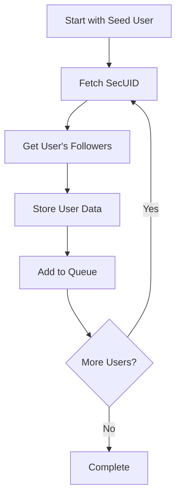

# 🌱 TikTok Recursive Follower Farmer

[](https://www.python.org/downloads/)
[](https://opensource.org/licenses/MIT)

A powerful Python tool that recursively harvests TikTok user data by traversing through follower networks. Starting with a seed username (0dayctf) it will then grab the followers data. After reaching the end of pagination for a user it will then use the secUid from another user to get their followers (Private accounts will be attempted then moved past gracefully). A new msToken is grabbed when 30 seconds has passed and no new unique users are found to ensure functionality. A unique users list is created and checked names to keep track for future runs if you crash or need to run it again in the future.

<p align="center">
  
</p>

```
uniqueId,followerCount,followingCount,videoCount,nickname,secUid,signature
```

# 📊 TikTok User Data Reference

Below is a comprehensive table showing example data collected by the scraper, including user statistics and profile information.

| uniqueId | Followers | Following | Videos | Nickname | SecUID | Bio |
|----------|-----------|-----------|---------|----------|--------|-----|
| fc25player937 | 769 | 58 | 1 | Qqwl | MS4wLjABAAAAgVnRFDSkZLXIk1vFUfOObAHpxIZ1QvcZgKve_2fxM5a4aULbOD1dS2lfBJ0Ixpbk | HALA MADRID!!! |
| coidstoner | 42 | 159 | 22 | coIdstoner | MS4wLjABAAAASjgGOj7Wkx6nvuLq91zvrcY49Hr2P6QAe5AFiaMb81iOBrtHi9kgjGa9RudzsgEF | 🦌🦌 |
| ameliajames255 | 1043 | 292 | 6 | Amelia James | MS4wLjABAAAAkGhf0Hoymac-32Y3rnl6xpiPtKM_yU_phyfCbrUoCM-oxspJuPh4HrraTxKQyAvh | I AM SINGLE MUM AND I AM DEPRESSED WITHOUT MAN |
| muraterdem527 | 47 | 788 | 5 | muraterdem529 | MS4wLjABAAAAUMruwsZHkyXQ1YI7by-z8Xh3ZJKhU8IydKHoY8o9Skq9sYO6dv7DF9UsHfiLQ-Ov | Murat Erdem! |
| rileyontop7 | 208 | 2990 | 7 | R1ley ⚽️ | MS4wLjABAAAAHd9pJ3CGhFxU-gd3dG8jlty1bes2ioOl_2L88PWqCE_dwmfdPveMfbDerXh-SIC9 | fam of 5/ 15/ love football ⚽️/ play drums 🥁 |
| ssjsaulo | 188 | 323 | 0 | saulito | MS4wLjABAAAABUKQJcN-7h3y9NEynOjjg9JCNw0dg03ntBvRULdAoWBPcwkNiiMSUVoQ38j3gMsT | 🫧🪬🛟🧉 |
| tommie6705 | 245 | 1345 | 7 | Tommie | MS4wLjABAAAA_GWpShlt4pVbuUv7vsVYayEAgFlLmx85lK_zVmSE0lQq3TlmP3hv6eSplLOc79vJ | Single |

## 📝 Column Descriptions

| Column | Description |
|--------|-------------|
| uniqueId | The user's unique TikTok identifier |
| Followers | Number of accounts following this user |
| Following | Number of accounts this user follows |
| Videos | Total number of videos posted |
| Nickname | User's display name |
| SecUID | Internal TikTok security identifier |
| Bio | User's profile description |

## 📊 Sample Statistics
- Highest follower count: 1,043 (ameliajames255)
- Most following: 2,990 (rileyontop7)
- Average video count: 6.9 videos
- Profile completion rate: 100% (all fields populated)

## 🔍 Data Format
This data is stored in CSV format with the following structure:
```csv
uniqueId,followerCount,followingCount,videoCount,nickname,secUid,signature
```

## ⚠️ Important Notes
- All data is collected from public profiles
- Follower/Following counts are point-in-time snapshots
- Bio text is preserved as-is, including emojis and formatting


## 🎯 Features

- 📊 Recursive follower traversal
- 🔄 Automatic rate limit handling
- 💾 CSV data export
- 📝 Comprehensive error logging
- 🚦 Progress tracking
- 🔒 Session management
- 📈 Real-time statistics

## 🛠️ How It Works

The script follows this process flow:



## 📋 Data Collection

The script collects the following user information:

| Field | Description |
|-------|-------------|
| uniqueId | User's TikTok username |
| followerCount | Number of followers |
| followingCount | Number of accounts followed |
| videoCount | Number of videos posted |
| nickname | Display name |
| secUid | Unique security identifier |
| signature | User's bio |

## 🚀 Installation

```bash
# Clone the repository
git clone https://github.com/pentestfunctions/tiktok-recursive-follower-farmer.git

# Install required packages
pip install -r requirements.txt

# Install Firefox WebDriver (required for token generation)
# Download geckodriver and place it in the project directory
```

## 📦 Dependencies

- requests
- selenium
- rich
- firefox-webdriver

## 🔧 Usage

1. Set up your environment:
   ```bash
   # Ensure geckodriver is in your project directory
   # Create empty files for data storage
   touch checked_names.txt tiktok_users.csv
   ```

2. Run the script:
   ```bash
   python3 scraper.py
   ```

## 🎛️ Configuration

The script uses several configuration variables that can be modified:

```python
headers = {
    "User-Agent": "Mozilla/5.0 ...",
    "Referer": "https://www.tiktok.com/",
}
```

## 📊 Output Files

| File | Purpose |
|------|---------|
| tiktok_users.csv | Stores all collected user data |
| checked_names.txt | Tracks processed users |
| failed_checks_{timestamp}.log | Records errors and failures |

## 🛡️ Error Handling

The script implements robust error handling:
- ⏳ Automatic retry mechanism for rate limits
- 🔄 Token refresh when needed
- 📝 Detailed error logging
- 🚫 Duplicate user prevention

## 📈 Performance

The script includes real-time performance monitoring:
- Users processed per second
- Users processed per minute
- Total unique users found
- Total accounts checked
- Failed checks counter
- Remaining users to check

## ⚠️ Important Notes

- 🕒 Respects TikTok's rate limits
- 🔑 Requires valid session tokens
- 📱 Uses Firefox in headless mode
- 💻 Supports resume functionality
- 🔍 Implements duplicate checking

## 🤝 Contributing

Contributions are welcome! Please feel free to submit a Pull Request.

## 📄 License

This project is licensed under the MIT License - see the LICENSE file for details.

## 🙏 Acknowledgments

- Rich library for beautiful console output
- Selenium for session management
- TikTok's public API structure

## ⚡ Performance Tips

1. Adjust sleep timers based on your needs
2. Monitor rate limiting responses
3. Use appropriate retry counts
4. Keep Firefox WebDriver updated
5. Monitor system resources

## 🔮 Future Improvements

- [ ] Add proxy support
- [ ] Implement multi-threading
- [ ] Add data export formats
- [ ] Improve token management
- [ ] Add user filtering options

Remember to use this tool responsibly and in accordance with TikTok's terms of service.
